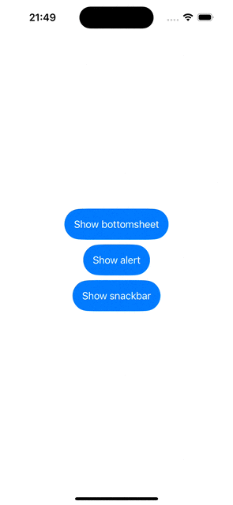
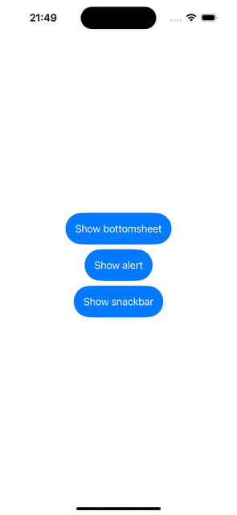
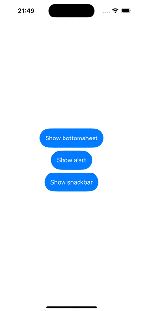

# CustomAlertKit

[](https://cocoapods.org/pods/CustomAlertKit)
[](https://cocoapods.org/pods/CustomAlertKit)
[](https://cocoapods.org/pods/CustomAlertKit)
[](https://swift.org/package-manager/)

## Installation
CustomAlertKit supports [Swift Package Manager](https://www.swift.org/package-manager/) and [CocoaPods](https://cocoapods.org/).

### Swift Package Manager

To install CustomAlertKit using Swift Package Manager you can follow the [tutorial published by Apple](https://developer.apple.com/documentation/xcode/adding_package_dependencies_to_your_app) using the URL for the repo:

1. In Xcode, select “File” → “Add Packages Dependencies”
1. Enter https://github.com/bence-t0th/CustomAlertKit.git

### CocoaPods

Add the pod to your Podfile:
```ruby
pod 'CustomAlertKit'
```
And then run:
```ruby
pod install
```
After installing the cocoapod into your project import CustomAlertKit with
```swift
import CustomAlertKit
```
## Usage

### Bottomsheet



```swift
@State var bottomsheetVisible = false

var body: some View {
    ...
    }
    .bottomSheet(visible: $bottomsheetVisible, background: .blur(.regular), contentBackgroundColor: .white) {
        Text("This is a bottomsheet with blurred background")
            .frame(height: 250)
    }
}
```

### Snackbar



```swift
@State var snackbarVisible = false

var body: some View {
    ...
    }
    .snackbar(visible: $snackbarVisible) {
        Text("This is a snackbar")
            .padding(16)
            .background(.green)
            .clipShape(Capsule())
    }
}
```

### Alert



```swift
@State var alertVisible = false

var body: some View {
    ...
    }
    .alert(visible: $alertVisible, background: .color(.black.opacity(0.4))) {
        VStack {
            Text("This is an alert with opaque background")
            Button(action: {
                withAnimation {
                    alertVisible.toggle()
                }
            }, label: {
                Text("Close")
            })
        }
        .padding(32)
        .background(.red)
    }
}
```

## Requirements

CustomAlertKit requires iOS 15 deployment target, and it is compatible only with SwiftUI.


## Author

[Bence Tóth](https://linkedin.com/in/bence-t0th/)

## License

CustomAlertKit is available under the MIT license. See the LICENSE file for more info.
